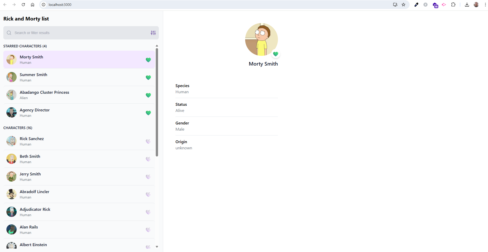
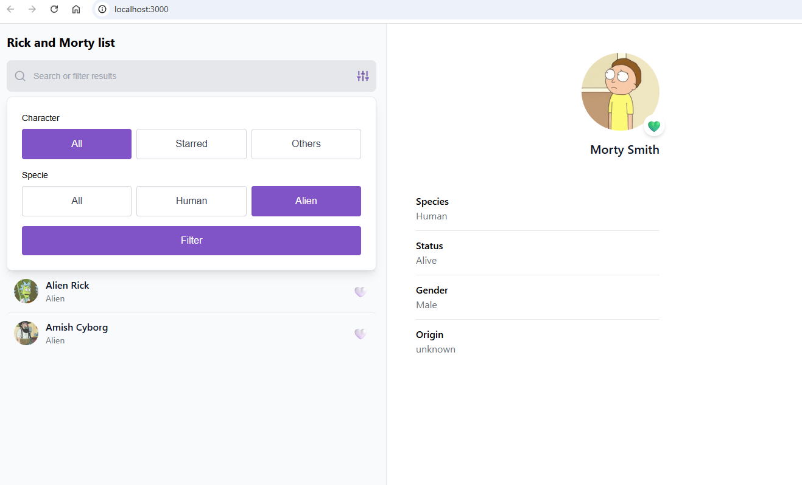
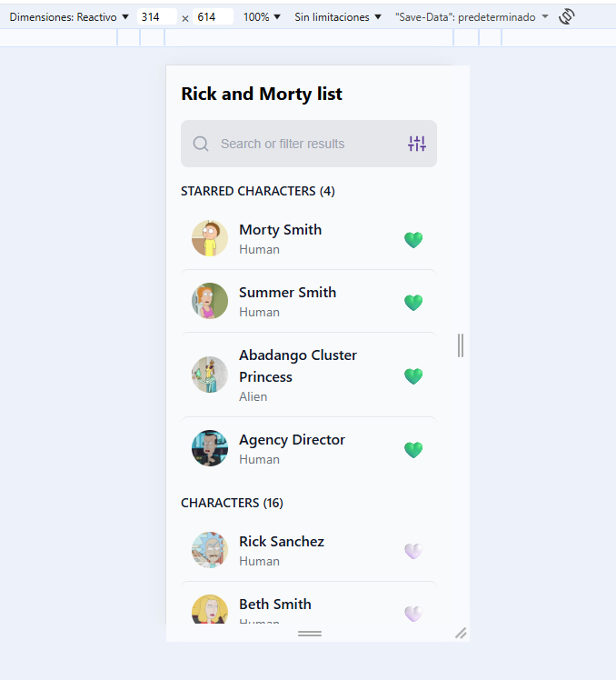
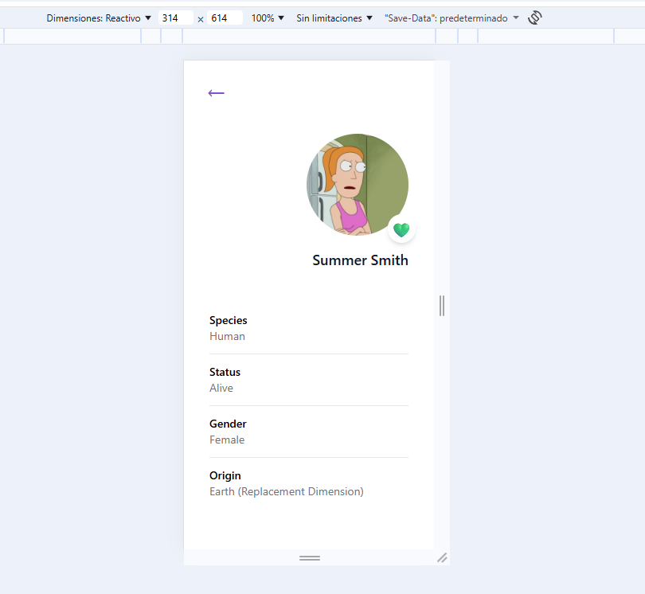
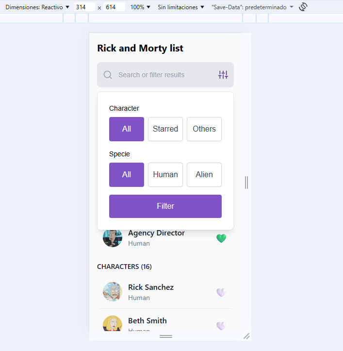
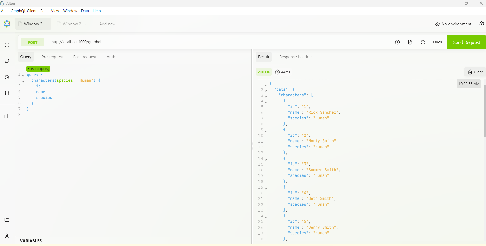
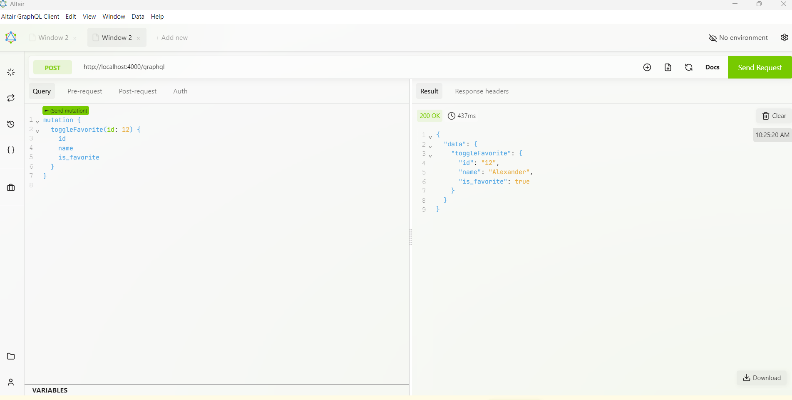
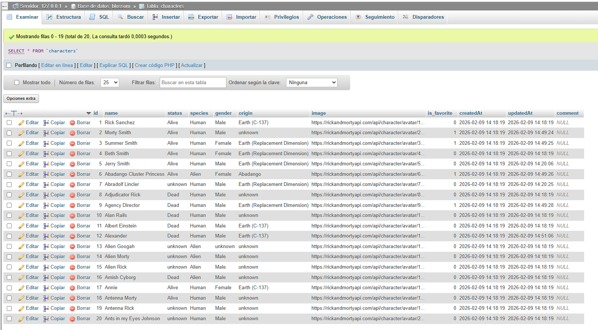
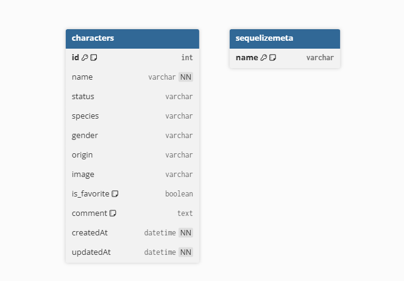

# Project Documentation – Blossom Rick & Morty App

## Overview
This document provides visual evidence of the application, database structure, and API usage.

---

## Frontend Screenshots

### Home Page and Character Detail

### Search & Filters

### Home Page Responsive version

### Character Detail Responsive version

### Search & Filters

---

## Backend – GraphQL API - Altair

### Example Query

### Toggle Favorite Mutation

---

## Database

### Characters Table

---

## ERD Diagram

### Database Entity Relationship Diagram

